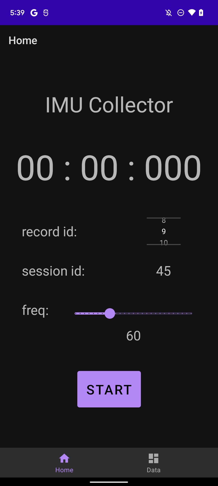

# IMU Collector
Android app that records imu data(accelerometer and gyroscope) for a specific period of time.

## Features
- Records accelerometer and gyroscope data
- Adjustable record id for different activities
- Exports data to .csv file ([demo file](demo/imu_1649657542256.csv))